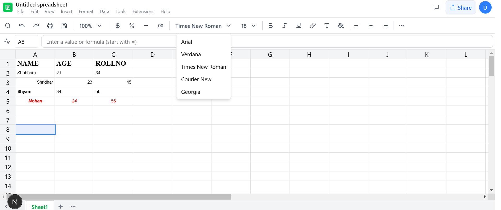
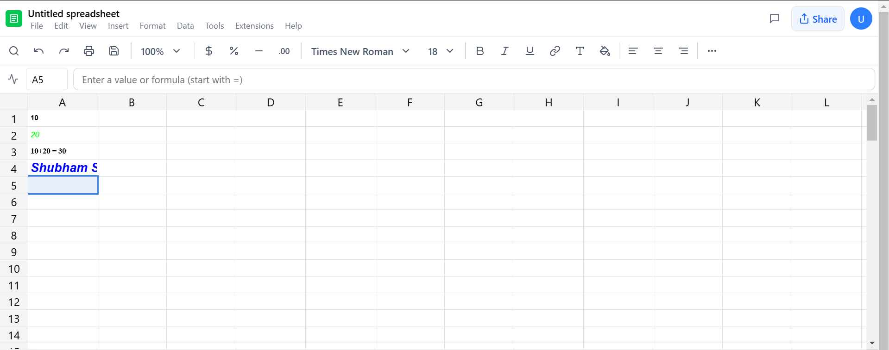

# Google Sheets Clone

A web application that closely mimics Google Sheets, built with Next.js, TypeScript, and Tailwind CSS.

# Screenshots



## Features

### 1. Spreadsheet Interface
- Google Sheets-like UI with toolbar, formula bar, and cell structure
- Drag functionality for cell content and selections
- Cell dependencies with formula support
- Basic cell formatting (bold, italics, font size, color)
- Add, delete, and resize rows and columns

### 2. Mathematical Functions
- `SUM`: Calculates the sum of a range of cells
- `AVERAGE`: Calculates the average of a range of cells
- `MAX`: Returns the maximum value from a range of cells
- `MIN`: Returns the minimum value from a range of cells
- `COUNT`: Counts the number of cells containing numerical values

### 3. Data Quality Functions
- `TRIM`: Removes leading and trailing whitespace
- `UPPER`: Converts text to uppercase
- `LOWER`: Converts text to lowercase
- `REMOVE_DUPLICATES`: Removes duplicate rows
- `FIND_AND_REPLACE`: Find and replace text in cells

### 4. Data Entry and Validation
- Support for various data types (numbers, text, dates)
- Data validation with error messages
- Formula evaluation and cell dependencies

## Tech Stack

### Frontend
- **Next.js**: React framework for the application
- **TypeScript**: Type safety and better developer experience
- **Tailwind CSS**: Utility-first CSS framework
- **shadcn/ui**: Reusable UI components
- **Lucide Icons**: Icon library

### State Management
- React's built-in useState and useCallback for local state
- Custom hooks for spreadsheet operations

### Data Structures

1. **SpreadsheetData**
```typescript
type SpreadsheetData = Record<number, Record<number, Cell>>

